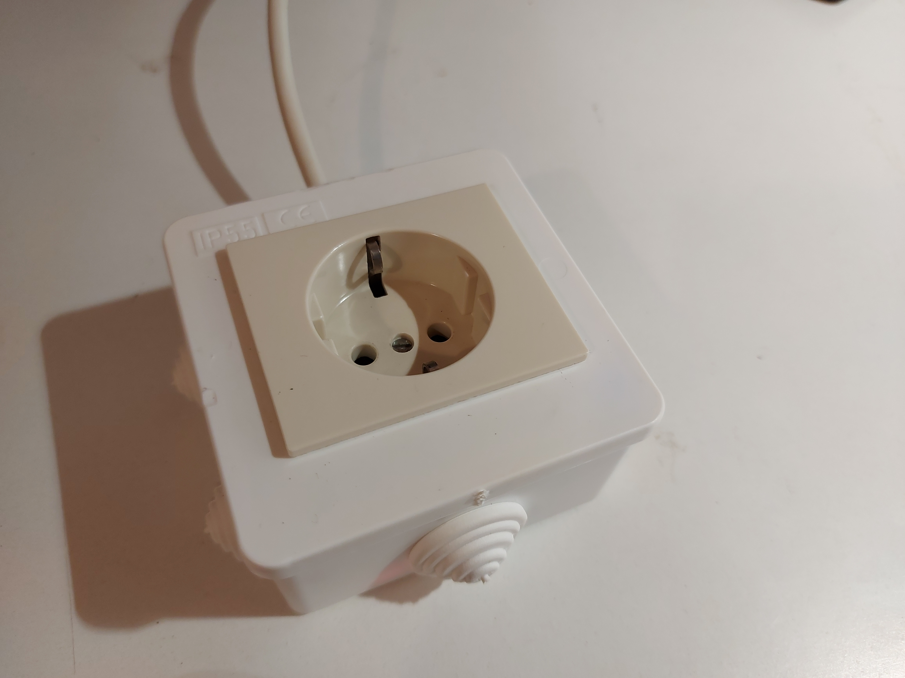

# Simple ESP8266 based smart switch

Intention for this project was to automate christmas lights. With this switch the lights would turn on at 17:00:00 and turn off at 3:00:00. ESP8266 requires internet connection in order to connect and fetch time data from closest ntp server.


# Hardware setup

Parts needed:

- [ESP-01 module](https://en.wikipedia.org/wiki/File:ESP-01.jpg)
- ESP-01 relay module
- small 230V AC to 5V DC power supply
- plastic box
- FTDI adapter
- other tools (soldering iron, screwdriver, hot glue, etc...)

# Software setup
### Step 1: Edit _user\_config.h_

1. edit \#define STA_SSID and \#define STA_PASS.
2. select timezone

### Step 2: Build

In order to buil application run _gen\_misc.sh_ file

```
./gen_misc.sh
```

compile options: 2 0 2 0 2, or other depending on module you're using.

### Step 3: Flash firmware

- Boot ESP8266 in programming mode (GPIO0 low on powerup)
- Erase flash (optional)

```
esptool.py erase_flash
```

- Flash binaries

```
esptool.py -p /dev/ttyUSB0 write_flash -ff 40m -fm qio -fs 1MB 0x0 ../bin/eagle.flash.bin 0x10000 ../bin/eagle.irom0text.bin 0xfb000 ../bin/blank.bin 0xfc000 ../bin/esp_init_data_default_v08.bin 0xfe000 ../bin/blank.bin
```


### Troubleshooting

**Why doesn't the application boot up properly?**

- It's important to build and flash the firmware with correct flash SPI settings. E.g. Some modules have flash chips which work in DOUT mode.


